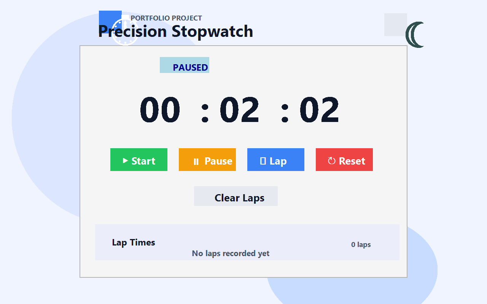

# ⏱️ Interactive Stopwatch Web Application

A polished stopwatch web app with lap tracking, fast/slow lap highlights, keyboard shortcuts, theme switching, and a clean portfolio-style interface built with HTML, CSS, and JavaScript.

## 🌐 Live Demo

**[View the Live Stopwatch](https://shreyapolicepatil27-droid.github.io/SCT_WD_2/)**

## 📸 Screenshot



## 📌 Project Overview

The Interactive Stopwatch is a browser-based application designed to provide accurate and easy-to-use time tracking. It demonstrates the practical use of HTML, CSS, and JavaScript to create an interactive web application with real-time updates and user controls.

## ✨ Features

- ▶️ Start / pause stopwatch controls
- ⏸️ Keyboard shortcut support with Space
- 🏁 Record lap times with highlighted fastest and slowest laps
- ♻️ Reset and clear laps actions
- 🌙 Dark/light mode toggle
- 📱 Mobile-friendly responsive layout
- ✨ Modern portfolio-style UI
- 📋 Organized lap history
- ⏱️ Millisecond precision display

## 🛠️ Technologies Used

- HTML5
- CSS3
- JavaScript

## 📂 Project Structure

```text
SCT_WD_2/
│
├── index.html
├── style.css
├── script.js
├── stopwatch-main.png
└── README.md
```

## ⚙️ How It Works

The stopwatch uses JavaScript time calculations to track elapsed time. When the user starts the stopwatch, the app records the start time and continuously calculates the difference between the current time and the start time.

The lap functionality calculates the difference between the current elapsed time and the previous lap time so users can track individual intervals.

## 🚀 How to Run Locally

1. Clone the repository:

```bash
git clone https://github.com/shreyapolicepatil27-droid/SCT_WD_2.git
```

2. Navigate to the project folder:

```bash
cd SCT_WD_2
```

3. Open the project in Visual Studio Code.

4. Open `index.html` using Live Server or run it directly in a browser.

## 🎯 Learning Outcomes

Through this project, I gained practical experience in:

- JavaScript event handling
- DOM manipulation
- Timer and time calculations
- Creating interactive web interfaces
- Responsive web design
- Git and GitHub version control
- Deploying a web application using GitHub Pages

## 🔮 Future Enhancements

Possible future improvements include:

- Keyboard shortcuts for stopwatch controls
- Dark and light mode
- Fastest and slowest lap detection
- Lap statistics
- Local storage for saving lap records
- Sound notifications
- Improved animations
- Exporting lap times

## 👩‍💻 Author

**Shreya Police Patil**

BTech – Information Science and Engineering

### Internship Project

**Web Development Internship – SCT_WD_2**

## 📄 License

This project is created for educational and internship purposes.
